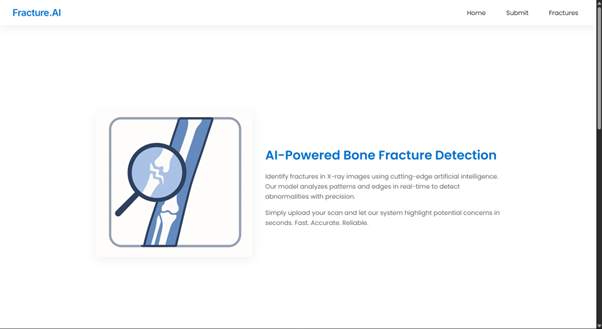
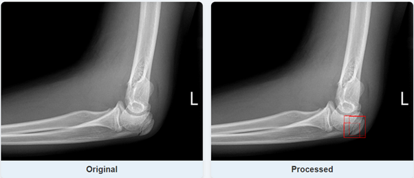

# 🦴Fracture.AI:  X-Ray Bone Fracture Detection App

An AI-powered deep learning web application that detects **bone fractures in X-ray images** within milliseconds using YOLOv8. Designed as a SaaS-ready diagnostic tool, this app aims to support medical professionals by providing fast and accurate analysis of radiographic images.

---

## 📸 App Preview

### 🏠 Home Screen

### 🔍 Detection Example

---

## 🚀 Key Features

- ⚡ Real-time fracture detection using **YOLOv8l**
- 🖼️ Drag-and-drop interface for uploading X-rays
- 🧠 Visual overlay of predicted fracture regions
- 📊 Precision-focused metrics suitable for medical analysis
- 🌐 Built as a **SaaS prototype** for potential clinical integration

---

## 🧠 Dataset

The model is trained using the **Bone Fracture Detection Computer Vision Dataset** from Kaggle, containing thousands of labeled X-ray images. The dataset includes diverse cases and bone types, enabling the model to generalize better across a range of fracture types.

📦 Dataset Link: [Kaggle Dataset](https://www.kaggle.com/datasets/pkdarabi/bone-fracture-detection-computer-vision-project)

---

## 🗂️ Project Structure

| Folder/File                                           | Description |
|------------------------------------------------------|-------------|
| `App v1.0/`                                          | Full application with frontend/backend |
| `Archive-x-ray/`                                     | 4K+ X-ray images used in model training |
| `Testing-images/`                                    | Folder for testing pre-trained model |
| `YOLOv8l_quick_run/`                                 | Pre-trained YOLOv8l model and usage docs |
| `train_yolov8_bone_fracture_detector v2.0.py`        | Script for dataset preprocessing & training |

---

## 📊 Model Performance

Performance metrics of the YOLOv8l model on the test set:

| Metric       | Value |
|--------------|-------|
| **mAP@50**   | 0.37  |
| **mAP@50-95**| 0.18  |
| **Precision**| 0.46  |
| **Recall**   | 0.26  |

> These results indicate that the model shows early promise for fracture detection and will be further optimized for clinical-grade usage.

---

## 🙌 Acknowledgements

- **Ultralytics YOLOv8** for real-time object detection
- **Kaggle** for dataset availability
- Open-source community and contributors

---